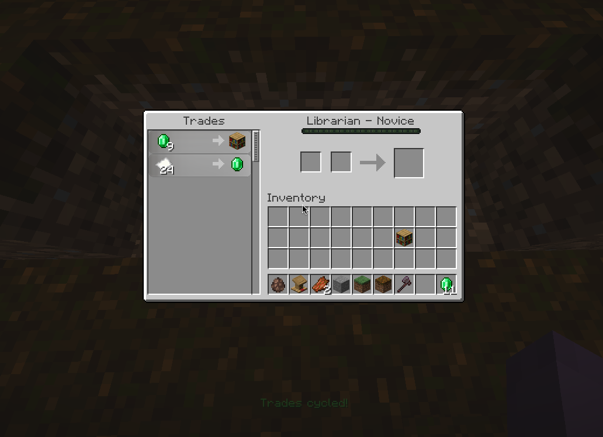
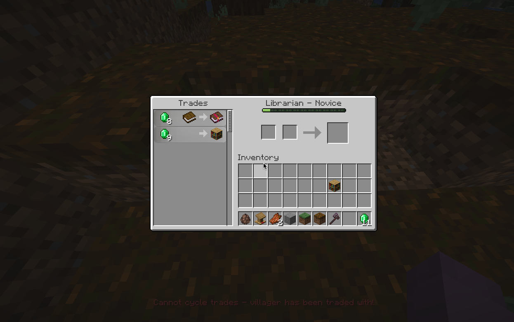

# Trade Cycle

### This Paper plugin is inspired by the mod [Trade Cycling](https://modrinth.com/mod/trade-cycling)

**NOTE**: This plugin only works with Paper 1.21.4 and above.

### How to use

1. Download the plugin from the latest release or build it yourself with:

```sh
./gradlew build
```

2. Put the plugin in your server's `plugins` folder.

3. Thats it !

### How it works

You shift Right Click or press F [(look at config)](#Config) a Villager with any item to cycle the trade!


When you already Traded with a Villiger, you cant cycle the trade anymore.


## Config

There are 2 Methods to Cycle Trades:

Shift Right Click and F Button Press

Which one to use you can config in the Config.yml like this:

```yaml
strategy:
  - KEYBOARD
# - SHIFT_INTERACT
```

That with the sharp(#) in front of it is deactivated and wont work.
You can use both at once for Bedrock Compatibility!

Keyboard = F Button Press

Shift_Interact = Shift Right Click

Also you can config which Message in which state show up:

```yaml
messages:
  NO_PROFESSION: "&cCannot cycle trades - villager has no job!"
  VILLAGER_LOCKED: "&cCannot cycle trades - villager has been traded with!"
  CYCLE_SUCCESS: "&aTrades cycled!"
```

All messages need to be filled in !!!
When you have a Problem you can open a Issue and i will look into your Problem.

**WARNING**: ONLY CONFIGURE THE YAML IF YOU KNOW WHAT YOU ARE DOING!

### License

Its a MIT License more infos in the [LICENSE](LICENSE) file.

### Contributing

Feel free to open a issue or a pull request, I will be happy to help you!

### Platforms to download it on

[Modrinth](https://modrinth.com/plugin/tradecycle)

[Paper Hangar](https://hangar.papermc.io/S42yt/TradeCycle)

[S42.site (My Page)](https://s42.site/shop)

## Contributers :D

- [Tamikaschu](https://github.com/tamikaschu)
