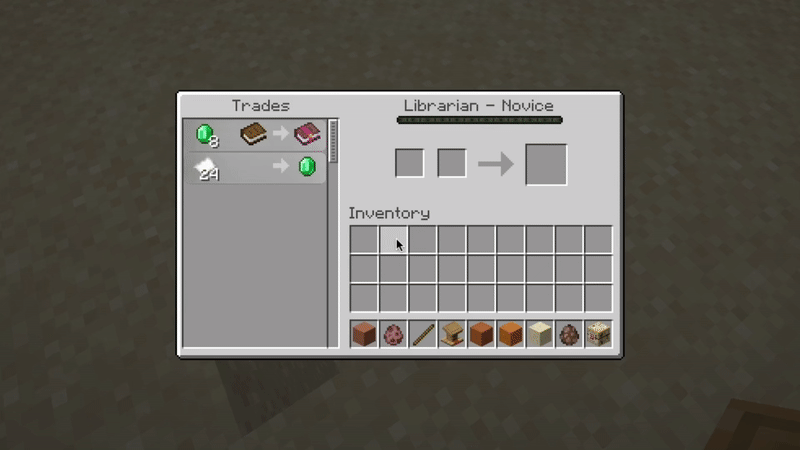
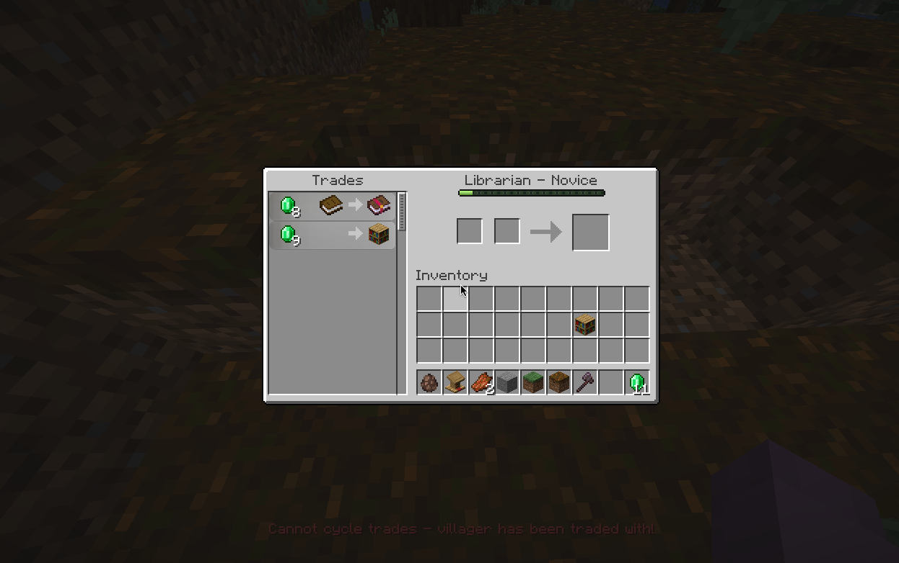

# TradeCycle 
 

### A [Paper](https://github.com/PaperMC/Paper) only plugin written in Kotlin to cycle through Villager trades from UI. Inspired by [henkelmax](https://modrinth.com/user/henkelmax)'s mod [Trade Cycling](https://modrinth.com/mod/trade-cycling).

<hr>

# Download
You can either download the plugin from the latest release or download it from the following sources:
- [Spigot](https://www.spigotmc.org/resources/tradecycle.122805/)
- [Modrinth](https://modrinth.com/plugin/tradecycle)
- [Hangar](https://hangar.papermc.io/S42yt/TradeCycle)
- [CurseForge](https://www.curseforge.com/minecraft/bukkit-plugins/tradecycle)
- [S42.site](https://s42.site/shop)

# Features
There are two variants to cycle through trades:
1. **Press F (default)**: Press the button associated with swapping the items to your offhand.
2. **Shift Right Click**: Shift right-click on the villager to cycle through trades. However, this variant is disabled by default, have a look at our [#Config](#Config) section to enable it.



### 🚨 Note: If a villager has no profession or has been traded with, you cannot cycle through trades.


# Config
You can configure which method (or both) should be used to cycle through trades:
```yaml
strategy:
  - KEYBOARD
# - SHIFT_INTERACT
```
'#' in front of a method will disable it.

# Contributing 🩷
Feel free to open an issue or a pull request, I will be happy to help you! Special thanks to every contributor of this project:

- [Tamikaschu](https://github.com/tamikaschu)
